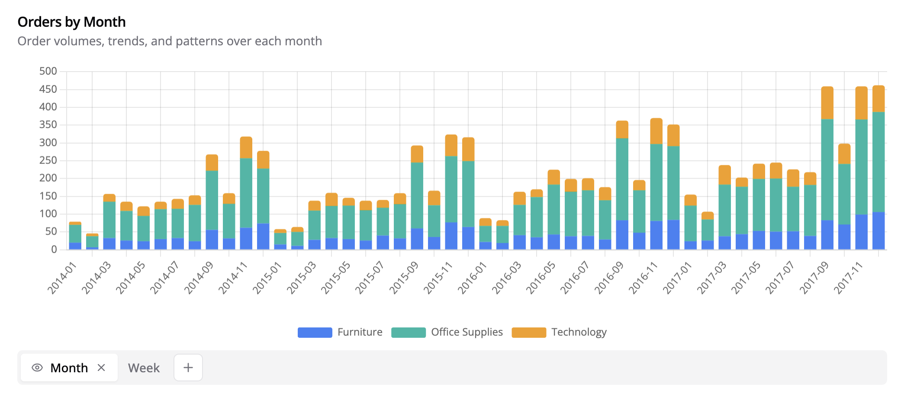
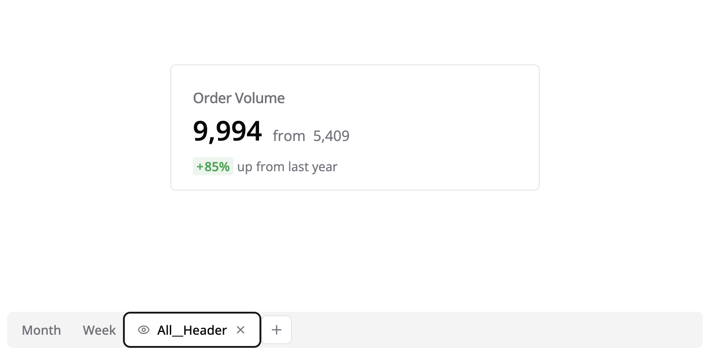
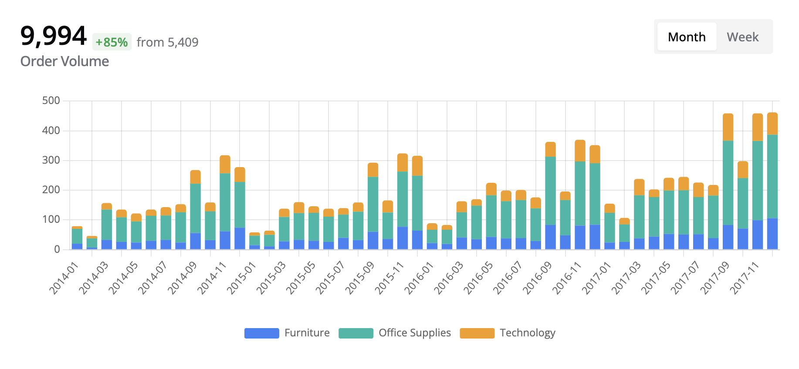
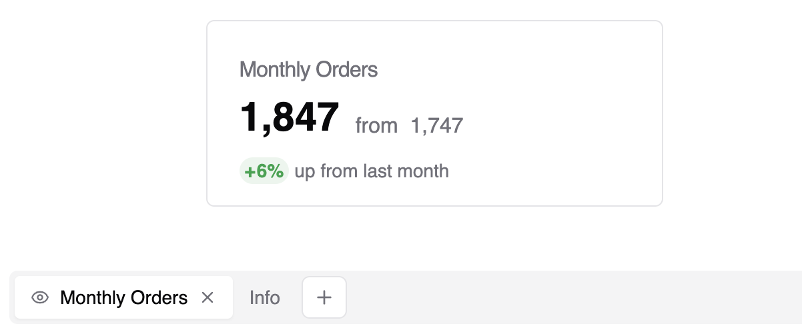
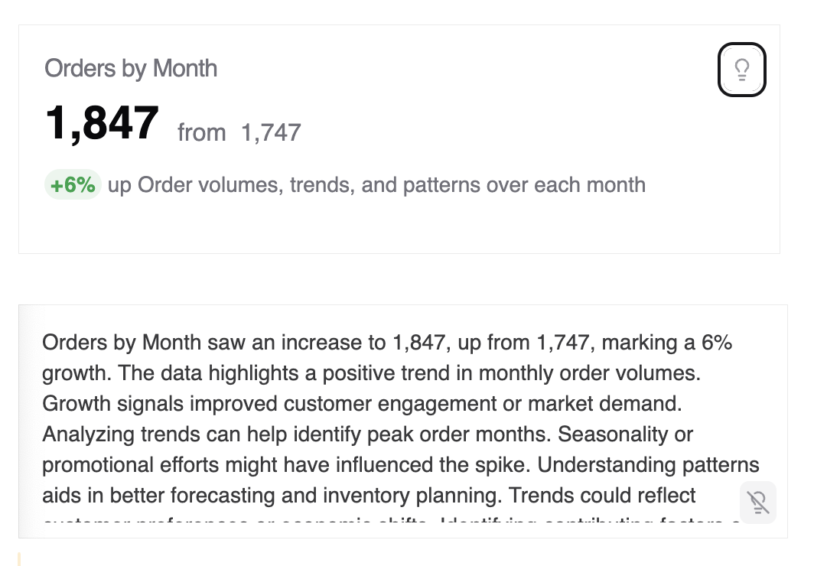

# Card Tabs

In Semaphor, each visual is displayed in a frame. But you can display multiple cards in a single frame by using card tabs. You can think of Semaphor frames as a deck of cards where each card is a visual.

In the example below, we have a frame with two tabs `Month` and `Week`. The first tab shows orders by month and the second tab shows orders by week.

### Global Header

You can also add a global header to the cards in a frame. In the example below, we have added a KPI card to the frame with a name `All__Header` separated by double underscores.

Note that `All__Header` is special naming convention in Semaphor. It instructs Semaphor to display this KPI card as a header for all cards in the frame. When you accept changes, you will see that the KPI card is displayed as a header for all cards in the frame.

### Local Header

You can also define a local header for individual cards. Local headers are displayed only when you switch that specific tab. To name a local header, you follow the below naming convention:

Name of the tab + `__Header`. Note \_\_ is a double underscore.

For example, if your tab is named `Orders by Month`, the local header should be named `Orders by Month__Header`.

### KPI Card Info

Similar to visual cards, you can also add textual descriptions to KPI cards to provide additional context or explanation. This enhances the user’s understanding of the data displayed on the KPI cards.

In the following example, we configure a KPI card alongside a descriptive text card:

- Monthly Orders (KPI Card Tab): Displays the primary key performance indicators (KPIs).
- Info: Serves as a description or explanatory text for the KPI card.

When you accept changes, you will see that the KPI card now has a `lightbulb` icon. Clicking on the icon will display the description card.

